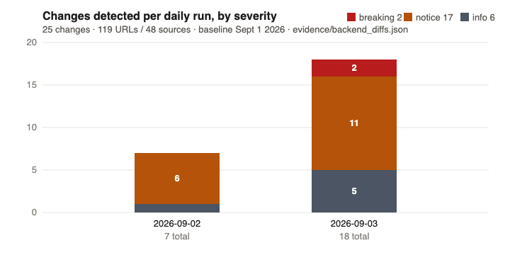
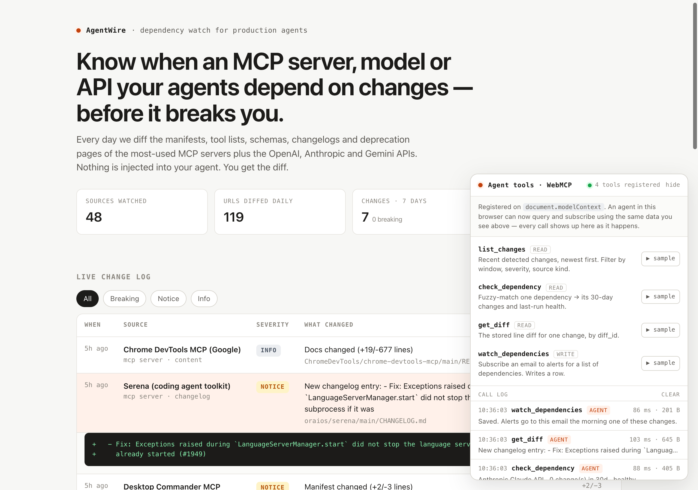
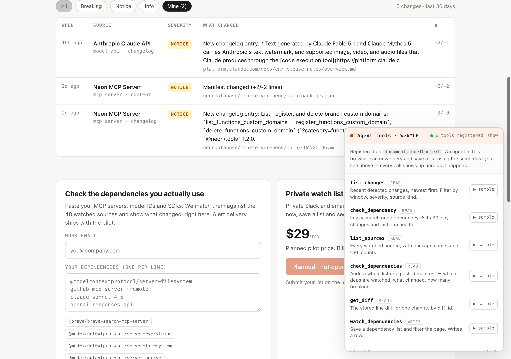
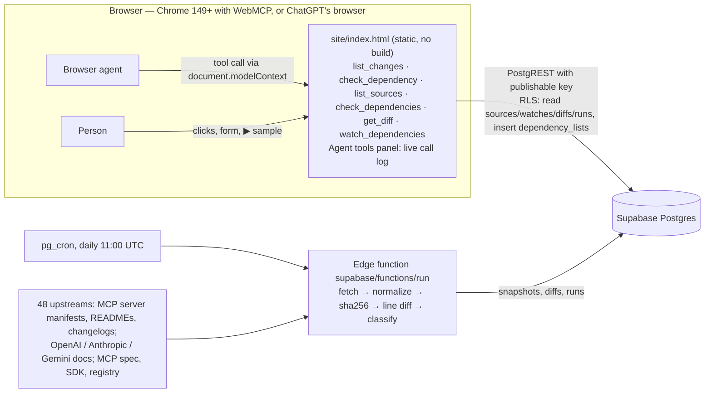

# AgentWire — dependency watch for production agents, with the agent on the page

**One line:** a daily diff of the MCP servers, model APIs and SDKs your agents depend on, exposed to the browser agent through six [WebMCP](https://developer.chrome.com/docs/ai/webmcp) tools on the same page a person uses.

Live: **https://agentwire.web.app** · Demo video (2:50): **https://youtu.be/z_lRFhLq9eQ** · Write-up: [SUBMISSION.md](SUBMISSION.md) · Evidence: [evidence/SUMMARY.md](evidence/SUMMARY.md)

## Evidence (all figures trace to files in `evidence/`)

| What | Measured | Where |
|---|---|---|
| Sources / URLs diffed daily | 48 sources · 119 URLs | `evidence/backend_sources.json`, `backend_watches.json` |
| Latest daily run | 2026-09-03 11:00 UTC · 119/119 fetched OK · 18 changes · 0 errors | `evidence/backend_runs.json` |
| Changes on record since the Sept 1 baseline | 25 across 13 sources · 2 breaking · 17 notice · 6 info | `evidence/backend_diffs.json` |
| Current production browser proof | 6/6 tools registered; five read tools plus structured-error cases invoked by Chrome, exit 0 | `evidence/smoke_live_2026-09-03_final.txt` |
| Historical browser proof before the final two read tools | 4/4 registered; 3 read tools invoked on a fresh clone and on production, exit 0 | `evidence/clean_clone_run.txt` |
| Historical tool latency (original three read tools; page-side, PostgREST included) | 93–195 ms per call | `evidence/SUMMARY.md` |
| Demo video | 2:50 · real Gemini agent · all five read tools exercised; consent-gated write explained but not invoked | [published video](https://youtu.be/z_lRFhLq9eQ) |







## Try it as a judge (90 seconds)

1. Open **https://agentwire.web.app** in Chrome 149+ with `chrome://flags/#enable-webmcp-testing` enabled (relaunch), or in ChatGPT's browser (tools appear under *Site tools*).
2. The **Agent tools · WebMCP** panel (bottom right) reads "6 tools registered". Ask the browser agent: *"Did the Neon MCP server change in the last 30 days, and is any of it breaking?"*
3. Watch the call land in the panel with its arguments and latency, the matched source light up, and the answer cite diff ids. Click **▶ sample** next to any tool to run the same function by hand and see a HUMAN entry beside the AGENT ones.

No agent handy? The quickstart below has Chrome invoke the tools itself. The [current production transcript](evidence/smoke_live_2026-09-03_final.txt) records all six tools; [clean_clone_run.txt](evidence/clean_clone_run.txt) is historical proof of the original four-tool version.

## Quickstart (three commands, no install)

```bash
git clone https://github.com/zaeem-rafiq/agentwire.git && cd agentwire
python3 -m http.server 8787 -d site &
node scripts/webmcp-smoke.mjs        # Chrome 149+ invokes the tools over the DevTools WebMCP domain
```

`make smoke`, `make smoke-live`, `make demo` and `make evidence` wrap the same commands (see [Makefile](Makefile)). Requires Node 22 and Google Chrome 149+ on the machine; nothing is installed.

## Architecture (what the code actually does)



The six tools use the same loaded data and `q()` PostgREST helper as the human UI. Five are read-only; `watch_dependencies` inserts one saved list. Calls mirror relevant state into the page (filter chips, highlighted source, expanded diff row, pre-filled form and the Mine filter).

## Safety and reliability

- **Read/write split is declared.** Five tools carry `readOnlyHint: true`; `watch_dependencies` is annotated as a non-destructive, non-idempotent write and its description tells the agent to confirm the email and list with the person first.
- **Inputs are constrained.** JSON Schemas use enums, ranges, `minItems`/`maxItems` and `additionalProperties: false`; `execute` re-validates the email and caps `deps` at 100.
- **The key in the page can only do what the page does.** Row-level security limits the publishable key to reading five tables and inserting into `dependency_lists` (length-checked); snapshots and secrets are service-role only. No secrets are in the repo (history scanned; see `SUBMISSION_CHECKLIST.md`).
- **Every agent call is visible.** The Agent tools panel logs tool, arguments, result size and latency for agent and human calls alike; pasted manifest bodies are redacted from the log.
- **Classification is heuristic.** Severity is inferred from version bumps, tool-list and schema changes and changelog wording; the linked source is always shown so a person can check.
- **Known limitations** are listed in [SUBMISSION.md](SUBMISSION.md#limitations).

## Prior work vs. work in the submission window

Everything in this repository's git history is inside the challenge window: the first commit is 2026-09-02 10:38 CDT ([evidence/git_history.txt](evidence/git_history.txt)). The Supabase project itself was created 2026-09-01 22:36 UTC (project metadata) and the diff engine, schema and original human page were applied the same day (comment at the top of `supabase/migrations/0001_init.sql`; first snapshots 22:53 UTC, first run 23:03 UTC), so the whole project post-dates the Aug 25 window start and is described in the [SUBMISSION.md](SUBMISSION.md) write-up as the pre-existing base. The WebMCP work — six current tools, the Agent tools panel, the Mine filter, the `scripts/webmcp-smoke.mjs` proof, and the real-agent demo pipeline in `demo/` — is the challenge submission. The current demo shows the six-tool version.

## WebMCP tools

Registered on `document.modelContext` at load (feature-detected; `navigator.modelContext` is checked as a fallback for older previews). Every call is logged. Tools that select a view mirror that state into the page — filter chips flip, the matched source is highlighted, the diff row expands, the form fills in, and list calls activate the Mine filter.

| Tool | Input | Returns | Side effect |
|---|---|---|---|
| `list_changes` | `since_hours?` (1–720, default 168), `severity?` (breaking/notice/info), `kind?` (mcp_server/model_api/spec) | recent changes, newest first | read-only; sets the severity filter in the UI |
| `check_dependency` | `name` (fuzzy: package, server, model ID, API) | best match + confidence, alternatives, changes in the last 30 days, last-run health for that source's URLs | read-only; highlights the source |
| `list_sources` | `kind?` (mcp_server/model_api/spec) | watched sources with package names, repository URLs and URL counts | read-only |
| `check_dependencies` | `deps[]?`, `manifest?`, `since_hours?` (1–720, default 168); `deps` or `manifest` required | per-dependency matches, changes and breaking counts, plus unmatched names | read-only; filters the UI to Mine and highlights the first match |
| `get_diff` | `diff_id` | the stored `- `/`+ ` line diff for one change | read-only; expands that row |
| `watch_dependencies` | `email`, `deps[]` (1–100), `workflow?` | confirmation | inserts one `dependency_lists` row; fills the form; filters the page to that list |

Enable it:

- **Chrome 149+**: `chrome://flags/#enable-webmcp-testing` → Enabled → relaunch, or serve the page from an origin enrolled in the [WebMCP origin trial](https://developer.chrome.com/origintrials/#/register_trial/4163014905550602241) (token goes in the `<meta http-equiv="origin-trial">` slot at the top of `site/index.html`).
- **ChatGPT's browser**: nothing to flip — tools appear under *Site tools* in the address bar.
- To watch calls by hand, install [WebMCP – Model Context Tool Inspector](https://chromewebstore.google.com/detail/gbpdfapgefenggkahomfgkhfehlcenpd); the "▶ sample" buttons in the panel run the same functions without an agent.

Smoke test (no dependencies; drives real Chrome over the DevTools `WebMCP` domain, so the *browser* invokes the tools):

    python3 -m http.server 8787 -d site &
    node scripts/webmcp-smoke.mjs                       # five read tools + structured-error cases
    WEBMCP_TEST_EMAIL=you@example.com node scripts/webmcp-smoke.mjs   # + the write tool

The [current production run](evidence/smoke_live_2026-09-03_final.txt) records every request/response for all six tools. [docs/webmcp-test-log.md](docs/webmcp-test-log.md) is the earlier four-tool run.

## What's here

- `site/index.html` — the whole front end: plain HTML + fetch against Supabase PostgREST (no build step), the WebMCP tool registrations and the Agent tools panel. Deploy as a static site.
- `scripts/webmcp-smoke.mjs` — dependency-free WebMCP smoke test (see above).
- `supabase/functions/run/index.ts` — the diff engine (Deno edge function). Fetches every active watch URL, normalizes (npm/PyPI/registry JSON, HTML → text, markdown as-is), hashes, multiset-line-diffs against the stored snapshot, classifies (version_bump / changelog / schema / tools / content; info / notice / breaking) and writes `diffs` rows. Runs daily from pg_cron.
- `supabase/migrations/0001_init.sql` — schema + RLS + cron.
- `data/sources.json` — the 48 watched sources / 119 URLs and why each was chosen.

## Live backend

Supabase project `bhhexzbupdksufmbcuab` (us-east-1). Publishable key is in `site/index.html`; it can only read `sources`, `watches`, `diffs`, `runs`, `site_config` and insert into `dependency_lists`.

## Local dev

Serve `site/` with any static server. To trigger the engine manually:

    curl -X POST https://bhhexzbupdksufmbcuab.supabase.co/functions/v1/run -H "x-run-token: $AGENTWIRE_RUN_TOKEN"

Optional query params: `offset`, `limit` (batching).

## Deploy

Firebase Hosting (Google Cloud project `agentwire-webmcp`, site `agentwire`), static, no build. `firebase.json` serves `site/` with clean URLs.

    firebase deploy --only hosting        # → https://agentwire.web.app

## License

MIT
